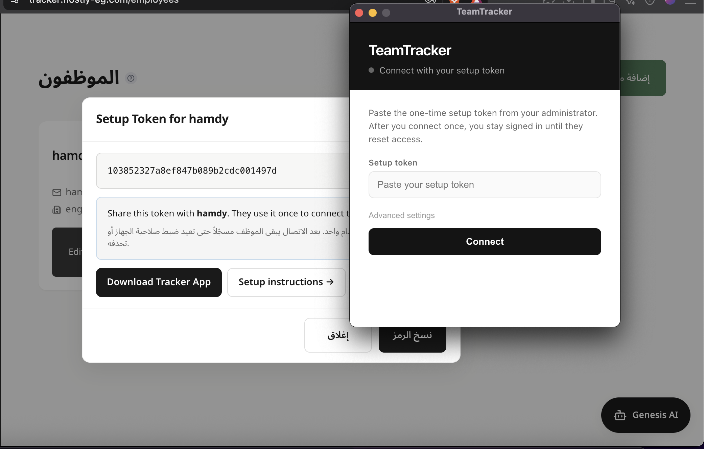

# TeamTracker

**See where your team’s time goes — clearly, fairly, and in real time.**

TeamTracker helps small businesses understand who’s working, what they’re working on, and where focus is lost — without enterprise complexity or price.

---

## Why TeamTracker

- **Live visibility** — who’s online, which apps are in use, and how productive the day looks
- **No timesheets** — a lightweight desktop app tracks activity automatically
- **Fair scoring** — roles and business hours are respected, so after-hours work doesn’t distort productivity
- **Plain-English insights** — ask questions like *“Who was most productive today?”*
- **Your brand** — add your logo and run the dashboard under your company identity
- **Works everywhere** — check the dashboard from desktop or phone

---

## How it works

1. **Create your account** and add your team  
2. **Install the desktop app** on each employee’s computer  
3. **Open the dashboard** — activity and scores appear within about a minute  

That’s it. No manual logging. No spreadsheets.

---

## What you can do

| Area | What you get |
|------|----------------|
| **Dashboard** | Team score, focus vs idle time, per-person breakdowns |
| **Reports** | Time by category, trends, and outside-hours activity |
| **AI assistant** | Answers about productivity, risk, and time use in plain language |
| **Screenshots** | Optional periodic captures you control and can review |
| **Daily summary** | Optional email digest of the day’s productivity |
| **Roles** | Auto-detects job types (developer, designer, manager, and more) — or set them yourself |
| **Rates** | Hourly rates in 15+ currencies |

---

## Developers

See [docs/DEVELOPER_GUIDE.md](docs/DEVELOPER_GUIDE.md) for package layout, where features/API/DB/WebSocket code lives, and how to run the full test suite.

## Getting started

### Cloud dashboard

### 1. Sign up
Open your TeamTracker signup page, create your company account, and **save your recovery codes** — you’ll need them if you ever reset your password.

### 2. Add your team
Go to **Employees → Add Employee**. Enter name, email, and department for each person.

### 3. Install the desktop app
For each employee, generate a **Setup Token** from the dashboard, share it with them, and have them paste it once in the TeamTracker desktop app to connect their device:



- **[Download for Mac, Windows, or Linux](https://github.com/hamdymohamedak/TeamTracker/releases)**

**First launch tips**

| Platform | What to expect |
|----------|----------------|
| **macOS** | Allow **Screen Recording** and **Accessibility**. If Gatekeeper warns, right-click → **Open**. |
| **Windows** | If SmartScreen appears, choose **More info → Run anyway**. |
| **Linux** | Use the AppImage or `.deb`. Grant screen-share permission when asked. |

After enrollment with the setup token, the employee should appear on your dashboard within about a minute.

### Local office (no cloud, no source code)

Run everything on your LAN with packaged apps:

1. Install **TeamTracker Admin** from [Releases](https://github.com/hamdymohamedak/TeamTracker/releases) on the manager’s computer — it embeds the server and advertises the office on the network.
2. Install **TeamTracker** (employee) on each workstation — pick the office from the list, paste the setup token (or use the QR / activation file).
3. Keep Admin running while the team is tracked.

Full guide: [LAN_SETUP.md](LAN_SETUP.md).

### 4. Watch it work
Open the dashboard on any device. You’ll see apps in use, time breakdowns, and productivity scores as they update.

**Live Activity** lets you view an employee’s screen in real time — stop, fullscreen, or capture a frame when you need it:


---

## Built for trust

- Activity data stays on **your** deployment — you control who sees it  
- Screenshots are **off by default** and fully configurable  
- Business hours keep after-hours work visible for audit, without punishing scores  

[Privacy Policy](./PRIVACY_POLICY.md)

---

## Self-hosting & docs

Prefer running it yourself? TeamTracker is designed for a single VPS — simple, affordable, and under your control.

- [Deployment guide](./docs/DEPLOYMENT.md)
- [LAN / local network setup](./LAN_SETUP.md) (Arabic operational guide for admin + employees on the same network)
- [Backup & restore](./docs/BACKUP_RESTORE.md)
- [Privacy details](./docs/PRIVACY.md)
- [Desktop signing](./docs/DESKTOP_SIGNING.md)

```bash
curl -sSL https://raw.githubusercontent.com/hamdymohamedak/TeamTracker/main/deploy.sh | bash
```

---

## License

[MIT](./LICENSE) — free to use, modify, and ship.

---

*Big-company clarity. Small-business simplicity.*
